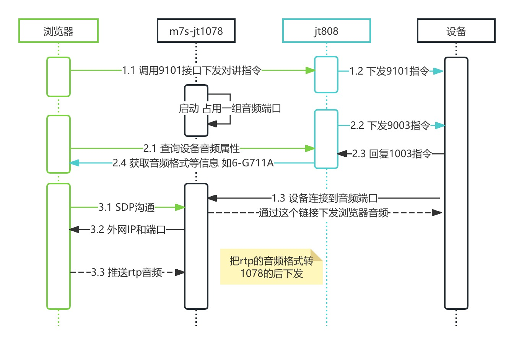
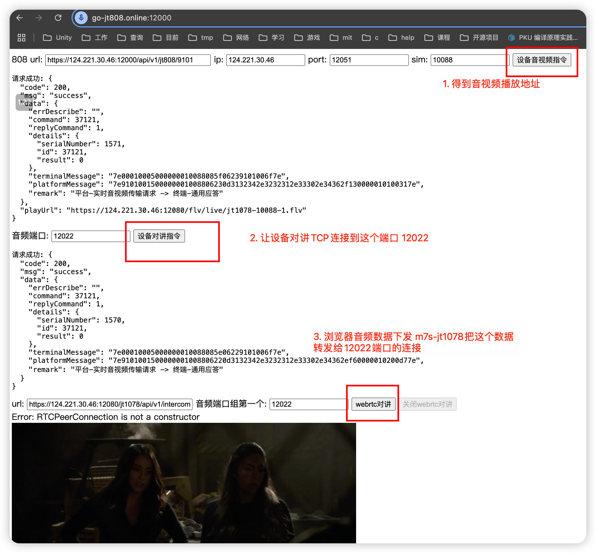

<h1 id="m7s"> m7s-jt1078 </h1>

- [m7s官方地址](https://monibuca.com)

---

| 例子 |  测试页面  | 代码 |
|----------|-----|-------------------|
| 音视频 | http://124.221.30.46:11000 | [详情点击](./example/video) |
| 对讲 | https://go-jt808.online:12000 | [详情点击](./example/intercom)  |
| 模拟流 | 视频 http://124.221.30.46:8088/preview/live/jt1078-295696659617-1?type=mp4 <br/> 音视频 http://124.221.30.46:8088/preview/live/jt1079-156987000796-1| [详情点击](./example/simulation)  |

---

<h2>对讲流程参考</h2>

- 需要设备连接到808服务 默认测试10088 sim卡号的设备连接到124.221.30.46:12001





<h3>一、 下发9101指令</h3>

``` http
### 对讲测试 设备连接到服务器端口
POST https://124.221.30.46:12000/api/v1/jt808/9101
Content-Type: application/json

{
  "key": "10088",
  "data": {
    "serverIPLen": 13,
    "serverIPAddr": "124.221.30.46",
    "tcpPort": 12022,
    "udpPort": 0,
    "channelNo": 1,
    "dataType": 2,
    "streamType": 0
  }
}
```

- 回调接口显示音频加入成功 说明设备对讲连接上来了

``` http
音频加入成功 {
  "port": 12022,
  "address": "124.221.30.46:45852"
}
```

<h3>二、 下发9003指令</h3>

``` http
### 查询设备音视频属性
POST https://124.221.30.46:12000/api/v1/jt808/9003
Content-Type: application/json

{
  "key": "10088",
  "data": {

  }
}

```

- 显示设备音频信息如下
- 参数参考 https://github.com/cuteLittleDevil/go-jt808/blob/main/protocol/model/t_0x1003.go

``` json
{
  "code": 200,
  "msg": "success",
  "data": {
    "errDescribe": "",
    "command": 36867,
    "replyCommand": 4099,
    "details": {
      "enterAudioEncoding": 6,
      "enterAudioChannelsNumber": 1,
      "enterAudioSampleRate": 0,
      "enterAudioSampleDigits": 1,
      "audioFrameLength": 320,
      "hasSupportedAudioOutput": 0,
      "videoEncoding": 98,
      "terminalSupportedMaxNumberOfAudioPhysicalChannels": 8,
      "terminalSupportedMaxNumberOfVideoPhysicalChannels": 8
    },
    "terminalMessage": "7e1003000a0000000100884e0406010001014000620808ff7e",
    "platformMessage": "7e900300000000000100880c796f7e",
    "remark": "平台-查询终端音视频属性 -> 终端-上传音视频属性"
  }
}
```

<h3>三、 浏览器webrtc下发音频给服务器</h3>

- SDP格式如下所示 额外增加一个组 把音频下发给这个组的

``` go
  type Request struct {
    webrtc.SessionDescription
    Group []struct {
        Sim       string `json:"sim"`
        Channel   uint8  `json:"channel"`
        AudioPort int    `json:"audioPort"`
    }
    // EnterAudioEncoding 音频类型参数 根据jt1078-2016表12 2-G722 6-G711A 7-G711U
    // 默认6-G711A
    EnterAudioEncoding int `json:"enterAudioEncoding"`
  }
```

- 服务器返回固定的外网IP和端口 ICE沟通可直接使用

<h3>四、关闭对讲</h3>

1. 浏览器端关闭对讲
2. 下发9102指令 让设备结束对讲

``` http
### 关闭对讲
POST https://124.221.30.46:12000/api/v1/jt808/9102
Content-Type: application/json

{
  "key": "10088",
  "data": {
    "channelNo": 1,
    "controlCmd": 4,
    "closeAudioVideoData": 0,
    "streamType": 0
  }
}
```

- 回调接口显示音频退出了 说明终端关闭了对讲 可重新使用该端口

``` http
音频离开 {
  "port": 12022,
  "address": "124.221.30.46:45852"
}
```

<h2> 配置说明 </h2>

``` yaml
jt1078:
  enable: true # 是否启用

  intercom:
    enable: true # 是否启用 用于双向对讲
    jt1078webrtc:
      port: 12020 # 外网UDP端口 用于浏览器webrtc把音频数据推到这个端口
      ip: 124.221.30.46 # 外网ip 用于SDP协商修改
    audioports: [12021, 12050] # 音频端口 [min,max]
    onjoinurl: "https://127.0.0.1:12000/api/v1/jt808/event/join-audio" # 设备连接到音频端口的回调
    onleaveurl: "https://127.0.0.1:12000/api/v1/jt808/event/leave-audio" # 设备断开了音频端口的回调
    overtimesecond: 60 # 多久没有下发对讲语言的数据 就关闭这个链接

  realtime: # 实时视频
    addr: '0.0.0.0:12051'
    onjoinurl: "https://127.0.0.1:12000/api/v1/jt808/event/real-time-join" # 设备连接到了实时视频指定端口的回调
    onleaveurl: "https://127.0.0.1:12000/api/v1/jt808/event/real-time-leave" # 设备断开了实时视频指定端口的回调
    prefix: "live/jt1078" # 默认自定义前缀-手机号-通道 如：live/jt1078-295696659617-1

  playback: # 回放视频
    addr: '0.0.0.0:12052'
    onjoinurl: "https://127.0.0.1:12000/api/v1/play-back-join" # 设备连接到了回放视频指定端口的回调
    onleaveurl: "https://127.0.0.1:12000/api/v1/play-back-leave" # 设备断开到了回放视频指定端口的回调
    prefix: "live/jt1079" # 默认自定义前缀-手机号-通道 如：live/jt1079-295696659617-1

  simulations:
    # jt1078文件 默认循环发送
      - name: ../testdata/data.txt
        addr: 127.0.0.1:12051 # 模拟实时
      - name: ../testdata/audio_data.txt
        addr: 127.0.0.1:12052 # 模拟回放

```