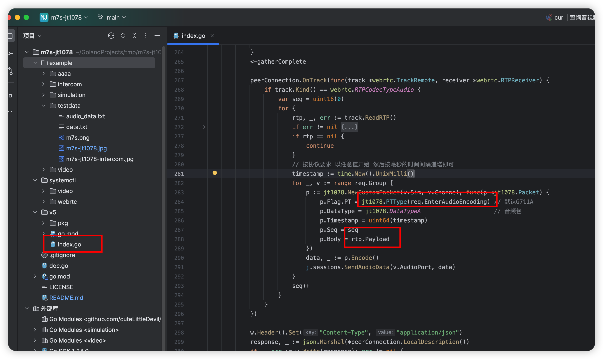

<h1> intercom </h1>

- 目前音频格式只支持G711A和G711U 如果需要其他的 需要自己fork使用ffmpeg转换
- 测试的音视频 使用视频 需要音视频的 修改9101的下发参数为1 （0-音视频 1-视频 2-双向对讲 3-监听 4-中心广播 5-透传)



``` txt
如图修改音频类型 和 音频数据的格式
可参考如下代码 进行音频转换 G711A -> PCM
```

``` go
func Test1(t *testing.T) {
	ctx, cancel := context.WithCancel(context.Background())
	// 创建 ffmpeg 命令
	cmd := exec.CommandContext(ctx, "ffmpeg",
		// pcm
		"-f", "alaw", // 输入格式为 G.711a (PCM A-law)
		"-ar", "8000", // 采样率，通常 G.711a 为 8000Hz
		"-i", "pipe:", // 从标准输入读取数据
		"-f", "s16le", // 输出格式为 PCM signed 16-bit little-endian
		"-acodec", "pcm_s16le", // 音频解码器为 PCM 16位有符号小端格式
		"-", // 输出到标准输出

		// aac
		//"-f", "alaw", // 输入格式为 G.711a (PCM A-law)
		//"-ar", "8000", // 采样率，通常 G.711a 为 8000Hz
		//"-i", "pipe:", // 从标准输入读取数据
		//"-f", "adts", // 输出格式为 AAC (ADTS 封装)
		//"-c:a", "aac", // 音频编码器为 AAC
		//"-b:a", "8000k", // 音频比特率
		//"-", // 输出到标准输出
	)

	// 创建输入管道
	in, err := cmd.StdinPipe()
	if err != nil {
		panic(err)
	}
	complete := make(chan struct{})
	go func() {
		time.Sleep(time.Second)
		// 模拟不断的获取浏览器的音频数据
		audioData, _ := os.ReadFile("./audio.txt")
		data, _ := hex.DecodeString(string(audioData))
		// 文件里面的rtp包内容都是160个字节的
		for i := 0; i < len(data); i += 160 {
			in.Write(data[i : i+160])
		}
		in.Close()
	}()

	go func() {
		// 其他异常情况 提前取消
		time.Sleep(time.Hour)
		cancel()
	}()

	// 创建输出缓冲区
	var out bytes.Buffer
	cmd.Stdout = &out

	go func() {
		time.Sleep(200 * time.Second)
		// 模拟不断读取ffmpeg转换后的音频格式数据
		data := make([]byte, 320)
		var file, _ = os.OpenFile("output.txt", os.O_APPEND|os.O_CREATE|os.O_WRONLY, 0o644)
		sum := 0
		for {
			if n, err := out.Read(data); err != nil {
				if errors.Is(err, io.EOF) {
					close(complete)
				}
				fmt.Println(err)
				break
			} else if n > 0 {
				sum++
				fmt.Println(n, sum, fmt.Sprintf("%x", data[:n]))
				file.Write(data[:n])
				file.Sync()
			}
		}
	}()

	fmt.Println(cmd.Start())
	fmt.Println(cmd.String())
	<-complete
	fmt.Println(cmd.Wait())
}

```